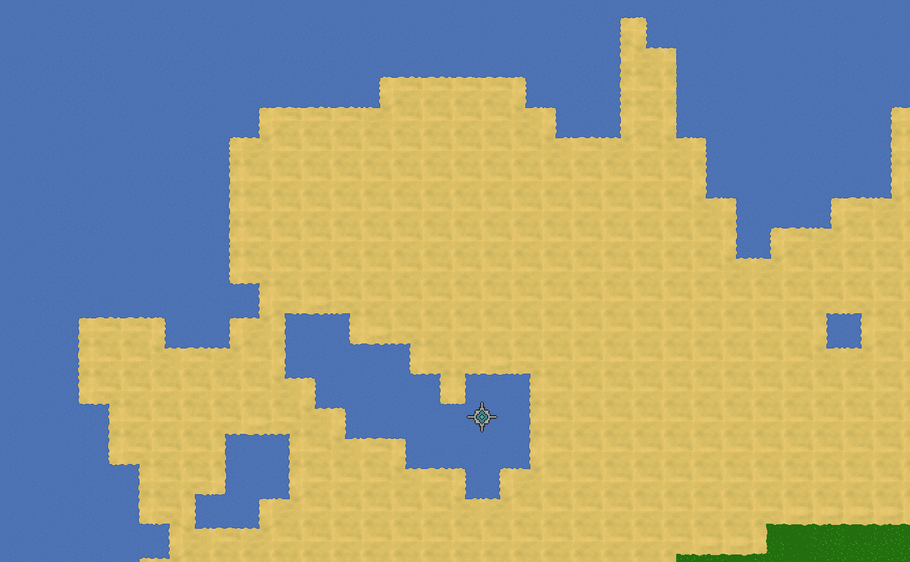

# TEXHEC
## What is TEXHEC ?

Texhec is a real time strategy game with unique resource we use to overtake our enemies.
We overtake our enemies using better army, research tree and/or economy.

## Current state of TEXHEC

We lack gameplay!

### What we have
Game scenes are temporary showing how modules can be used.

Engine modules written:
- transform
- hierarchy
- layout
- transition
- text
- render
- generation
- camera
- batcher
- groups

And more engine and game modules you can find in `engine/modules` and `core/modules`

Example map generated in a matter of seconds and rendered in less than 6ms\
using 5 years old Intel® Core™ i5-8350U × 8 Intel® UHD Graphics 620 (KBL GT2):



### What is next
Next in list:
- units
- buildings
- players

## How to run ?

### Install dependencies
Install packages for:
- opengl
- sdl2

ubuntu:
```
sudo apt install libsdl2-dev libsdl2-image-dev libsdl2-ttf-dev libsdl2-mixer-dev
sudo apt install mesa-common-dev libglew-dev libglu1-mesa-dev
```

arch:
```
sudo pacman -S sdl2 mesa libglew glue
sudo pacman -S sdl2_image sdl2_mixer sdl2_ttf
```

### Run

```
cd core
go run .
```

## Technologies

- golang
- opengl

We omit dependencies as much as we can.
We follow **DOD (data oriented design)** by using self written ecs package.
Despite using golang we achieve best performance like rendering **1.000.000 dual-grid** tiles in 5-6 ms.
Its all due to us handling data not abstractions.

## License

Internal/Private.
Currently this repo is public to allow to see code and what it does for recruitment
